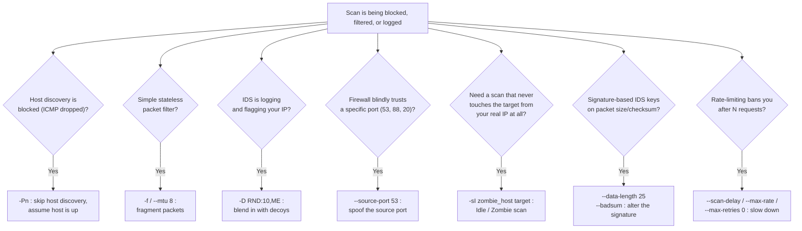
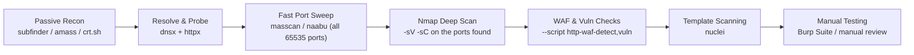

# The Complete Nmap Guide (2026 Edition)

A comprehensive cheat sheet covering everything from basic Nmap commands to advanced scanning, firewall/IDS evasion, and a bug-bounty-focused recon workflow. Built for network exploration and security auditing

> ⚠️ **Legal & Ethical Use**
> Every technique below sends real packets to real machines. Only run these against systems you own, systems you have explicit written authorization to test, or a bug bounty program's clearly in-scope assets. Unauthorized scanning can be illegal (e.g. under the U.S. CFAA, UK Computer Misuse Act, and equivalent laws elsewhere) and can get you banned from a program even when it isn't.

## Table of Contents

1. [Target Specification](#target-specification)
2. [Scan Types](#scan-types)
3. [Host Discovery](#host-discovery)
4. [Port Scanning](#port-scanning)
5. [Service & Version Detection](#service--version-detection)
6. [OS Detection](#os-detection)
7. [Output Formats](#output-formats)
8. [Timing and Performance](#timing-and-performance)
9. [Firewall & IDS Evasion — Deep Dive](#firewall--ids-evasion--deep-dive)
10. [Nmap Scripting Engine (NSE)](#nmap-scripting-engine-nse)
11. [Bug Bounty Recon Playbook](#bug-bounty-recon-playbook)
12. [Real-World One-Liners](#real-world-one-liners)
13. [Learn More & Contribute](#learn-more--contribute)

---

## Target Specification

* **Single IP**: `nmap <target>` (e.g., `nmap 192.168.1.1`)
* **Multiple IPs**: `nmap <target1> <target2>` (e.g., `nmap 192.168.1.1 192.168.1.2`)
* **IP Range**: `nmap <range>` (e.g., `nmap 192.168.1.1-254`)
* **Domain**: `nmap <domain>` (e.g., `nmap scanme.nmap.org`)
* **CIDR Subnet**: `nmap <CIDR>` (e.g., `nmap 192.168.1.0/24`)
* **IPv6 Target**: `nmap -6 <target>` (e.g., `nmap -6 fe80::1`)
* **List from File**: `nmap -iL <file>` (e.g., `nmap -iL targets.txt`)
* **Random Hosts**: `nmap -iR <count>` (e.g., `nmap -iR 100`)
* **Exclude Targets**: `nmap --exclude <target>` (e.g., `nmap 192.168.1.0/24 --exclude 192.168.1.1`)
* **Exclude via File**: `nmap --excludefile blocklist.txt <CIDR>` (keeps out-of-scope hosts out of a large scan automatically)

## Scan Types

* **TCP SYN Scan (Stealth)**: `nmap -sS <target>` — default when running as root/admin. Fast, never completes the handshake.
* **TCP Connect Scan**: `nmap -sT <target>` — default for non-root users. Completes the full 3-way handshake.
* **UDP Scan**: `nmap -sU <target>` — slower, but necessary for DNS, SNMP, and DHCP enumeration.
* **TCP ACK Scan**: `nmap -sA <target>` — maps firewall rule sets; determines filtered vs. unfiltered, not open vs. closed.
* **TCP Window Scan**: `nmap -sW <target>` — like an ACK scan, but inspects the TCP window size in RST replies; on some stacks this reveals open vs. closed.
* **Maimon Scan**: `nmap -sM <target>` — sends FIN/ACK probes; some BSD-derived systems respond in ways that leak port state.
* **Stealth / Evasion Scans**: `nmap -sF` (FIN), `-sX` (Xmas), `-sN` (Null) — abuse RFC-compliant vs. non-compliant TCP stack behavior to slip past stateless filters that only watch for SYN packets.
* **IP Protocol Scan**: `nmap -sO <target>` — determines which IP protocols (TCP, UDP, ICMP, GRE, etc.) a host responds to.
* **SCTP INIT Scan**: `nmap -sY <target>` — the SCTP analog of a SYN scan.
* **SCTP COOKIE ECHO Scan**: `nmap -sZ <target>` — stealthier SCTP scan that can slip past firewalls configured only to block INIT chunks, at the cost of not distinguishing open from filtered.
* **Idle / Zombie Scan**: `nmap -sI <zombie> <target>` — see the [Evasion Deep Dive](#idle-zombie-scan--si) below.

## Host Discovery

* **Skip Ping (No Discovery)**: `nmap -Pn <target>` — treats all hosts as online. Crucial for bypassing firewalls that block ICMP.
* **Ping Scan Only**: `nmap -sn <target>` — identifies live hosts without scanning ports. Extremely fast.
* **List Targets Only**: `nmap -sL <target>` — resolves DNS without sending any packets to the target.
* **TCP SYN/ACK Ping**: `nmap -PS<ports> <target>` / `nmap -PA<ports> <target>` — uses SYN or ACK packets to bypass standard ICMP blocks.
* **UDP Ping**: `nmap -PU<ports> <target>` — useful for hosts that silently drop ICMP and TCP probes but still answer UDP.
* **ARP Ping**: `nmap -PR <target>` — highly effective, and used by default, for local network discovery.

## Port Scanning

* **Specific Port(s)**: `nmap -p 80,443 <target>`
* **Port Range**: `nmap -p 21-100 <target>`
* **All 65,535 Ports**: `nmap -p- <target>`
* **Top 100 Fast Scan**: `nmap -F <target>`
* **Top 'X' Ports**: `nmap --top-ports 1000 <target>` — scans the most common ports based on Nmap's frequency dataset.
* **Sequential Scan**: `nmap -r <target>` — disables port randomization, scanning strictly from lowest to highest.

## Service & Version Detection

* **Standard Detection**: `nmap -sV <target>` — probes open ports for banner and version info.
* **Intensity Levels**: `nmap -sV --version-intensity <0-9> <target>` — 0 is light/fast, 9 tries every single probe.
* **Light Mode**: `nmap -sV --version-light <target>` — alias for intensity 2.
* **Aggressive Mode**: `nmap -sV --version-all <target>` — alias for intensity 9. Slowest but most thorough; use it when a service's banner has been stripped or altered and default probes come back empty.

## OS Detection

* **Standard OS Detection**: `nmap -O <target>` — requires at least one open and one closed port to guess accurately.
* **Aggressive Guessing**: `nmap -O --osscan-guess <target>`
* **The "Everything" Scan**: `nmap -A <target>` — combines OS detection, version detection, script scanning, and traceroute.

## Output Formats

* **Normal Output**: `nmap -oN <file> <target>` — standard terminal output saved to a text file.
* **Grepable Output**: `nmap -oG <file> <target>` — single-line format, easily parsed by `grep` or `awk`.
* **XML Output**: `nmap -oX <file> <target>` — ideal for importing into vulnerability scanners, reporting tools, or feeding into a Python/Nuclei pipeline.
* **Output All Formats**: `nmap -oA <file> <target>` — generates `.nmap`, `.gnmap`, and `.xml` simultaneously.
* **Show Open Ports Only**: `nmap --open <target>` — filters out closed and filtered ports to reduce noise.
* **Show Reason**: `nmap --reason <target>` — prints the specific packet that led Nmap to each state conclusion; invaluable when validating a firewall ruleset.

## Timing and Performance

* **Speed Profiles**: `nmap -T<0-5> <target>` — T0 is paranoid/stealthy, T3 is default, T4 is fast, T5 is aggressive/insane.
* **Minimum Rate Limit**: `nmap --min-rate <number> <target>` — forces Nmap to send packets no slower than `<number>`/sec. Great for large ranges.
* **Maximum Rate Limit**: `nmap --max-rate <number> <target>` — throttles scan speed to avoid crashing fragile services or tripping a WAF's request-rate rule.
* **Limit Retries**: `nmap --max-retries <number> <target>` — speeds up scans on networks with high packet loss (or avoids retransmissions that could trigger a ban).
* **Host Timeout**: `nmap --host-timeout <time> <target>` — e.g., `30m`. Skips a host if it takes too long to scan.
* **Scan Delay**: `nmap --scan-delay <time> <target>` — fixed pause between probes; the core knob for stealth over speed.
* **Parallelism**: `nmap --min-parallelism <n> --max-parallelism <n> <target>` — controls how many probes are outstanding at once; lowering this looks less like a burst scan.

| Template | Name | Typical use |
|---|---|---|
| `-T0` | Paranoid | IDS evasion over hours/days, one probe at a time |
| `-T1` | Sneaky | Slow evasion, minutes between probes |
| `-T2` | Polite | Reduces bandwidth/target load, still cautious |
| `-T3` | Normal | Default, balanced |
| `-T4` | Aggressive | Fast networks, most CTF/lab/bug-bounty scans |
| `-T5` | Insane | Maximum speed, assumes a very fast, reliable network |

---

## Firewall & IDS Evasion — Deep Dive



### Packet-Level Techniques

* **Packet Fragmentation**: `nmap -f <target>` — splits probes into 8-byte IP fragments so simple packet filters and older IDS engines that don't reassemble fragments can't inspect the full header. `-f -f` (or `-ff`) doubles that to 16-byte fragments.
* **Custom MTU**: `nmap --mtu 24 <target>` — same idea as `-f` but lets you set an exact fragment size; must be a multiple of 8. Reassembly costs the firewall CPU, and fragments can even take divergent network paths.
* **Custom Data Length**: `nmap --data-length 25 <target>` — appends random bytes to each packet. Many signature-based IDS rules key off the "empty" 40–44 byte size of a stock Nmap probe; padding the packet breaks that fingerprint.
* **Bad Checksums**: `nmap --badsum <target>` — sends a deliberately invalid TCP/UDP checksum. A real target's TCP/IP stack will silently drop it, but a firewall or IDS that doesn't validate checksums may still reply — which tells you a middlebox, not the host, answered.

### Identity & Path Obfuscation

* **Decoy Scans**: `nmap -D RND:10,ME <target>` — spoofs 10 random IPs alongside your own so IDS logs show many "attackers" at once. Use `ME` to control where your real IP sits in the list. Caveat: modern IDS can sometimes fingerprint decoy traffic patterns and flag every IP in the batch, including yours, and some ISPs filter obviously spoofed packets before they even leave your network.
* **Source Port Spoofing**: `nmap --source-port 53 <target>` (or `-g 53`) — mimics DNS/HTTP traffic to slip past firewalls that are misconfigured to trust a specific source port rather than actually inspecting the connection.
* **MAC Spoofing**: `nmap --spoof-mac 0|<vendor>|<MAC> <target>` — randomizes or sets your MAC address on the local segment, useful for L2 network access-control evasion and avoiding MAC-based logging.
* **Randomize Target Order**: `nmap --randomize-hosts <target list>` — scans hosts in random order instead of sequentially, which makes the traffic pattern less obviously "someone is walking my subnet."
* **Skip DNS Resolution**: `nmap -n <target>` — avoids reverse-DNS lookups, which both speeds things up and avoids leaving a trail in a target's own DNS server logs.

### Firewall Rule Mapping

* **ACK Scan**: `nmap -sA <target>` — doesn't determine open/closed, but tells you which ports a stateful firewall allows through vs. filters, which is exactly what you need before choosing an evasion angle.
* **Window / Maimon Scans**: `nmap -sW <target>` / `nmap -sM <target>` — situational alternatives to ACK scanning that occasionally leak open-vs-closed state on specific OS TCP stack quirks (mostly older BSD-derived systems).

### Idle / Zombie Scan (`-sI`)

```
nmap -sI <zombie_host> <target>
```
The most anonymous scan Nmap offers: no packet ever leaves your real IP toward the target. It works by exploiting hosts whose IP ID (IPID) field increments predictably and sequentially:

1. Nmap checks the zombie's current IPID.
2. It sends a SYN packet to the target, **spoofed to look like it came from the zombie**.
3. If the target port is open, it replies to the zombie with a SYN/ACK, which the zombie doesn't expect — so the zombie's TCP stack replies with a RST, incrementing its IPID.
4. Nmap re-checks the zombie's IPID. A jump of 2 means the port is likely open; no jump means closed or filtered.

The catch: you need a genuinely idle host with a **predictable, sequential IPID**. Modern Linux and recent Windows randomize IPIDs, so they can't be used as zombies. Old Windows boxes, network printers, and embedded/IoT devices are the classic candidates. Any firewall logs from the scan will point entirely at the innocent zombie.

### FTP Bounce Scan (`-b`) — historical

```
nmap -b <ftp_relay_user:pass@ftp_server> <target>
```
Abuses the old FTP `PORT` command to make an FTP server open a data connection to an arbitrary third-party host on your behalf, effectively using the FTP server as an open proxy for your scan. It's included here for completeness and for understanding legacy CVEs — virtually every FTP server shipped since the early 2000s has this behavior disabled, so treat it as a historical/educational technique rather than something you'll rely on in the field.

### Proxy Chains

* **Route Through Proxies**: `nmap --proxies http://proxy1,socks4://proxy2 <target>` — chains your scan traffic through one or more proxies (mainly affects TCP connect-style scans).

---

## Nmap Scripting Engine (NSE)

Nmap scripts (`.nse` files) automate vulnerability checks, brute forcing, and enumeration.

* **Run Default Safe Scripts**: `nmap -sC <target>`
* **Run a Specific Script**: `nmap --script=<script-name> <target>`
* **Run a Category**: `nmap --script=vuln,discovery,safe <target>`

**Essential Web Scripts**

* `nmap -p 80,443 --script=http-enum <target>` — enumerates directories and common apps.
* `nmap -p 80 --script=http-wordpress-enum <target>`
* `nmap -p 80,443 --script=http-title,http-robots.txt <target>`
* `nmap -p 443 --script=ssl-cert,ssl-enum-ciphers <target>` — evaluates TLS/SSL configuration **and** dumps the certificate's Subject Alternative Name (SAN) field, which often lists every other subdomain the same cert covers — a free subdomain-discovery bonus.
* `nmap -p 80,443 --script=http-waf-detect,http-waf-fingerprint <target>` — flags whether a WAF/IDS/IPS is sitting in front of the web server (and sometimes which product), so you know up front whether to expect blocking and can plan accordingly.
* `nmap -p 80,443 --script=http-methods <target>` — lists which HTTP verbs are accepted (handy for spotting risky methods like `PUT` or `TRACE` left enabled).

**Brute Force & Auth Checking**

* `nmap -p 22 --script=ssh-brute --script-args userdb=users.txt,passdb=passwords.txt <target>`
* `nmap -p 3306 --script=mysql-empty-password <target>`
* `nmap -p 3306 --script=mysql-brute <target>`

**Network Protocol Enumeration**

* `nmap -p 445 --script=smb-enum-shares,smb-os-discovery <target>` — deep dives into Windows SMB.
* `nmap --script=dns-brute --script-args dns-brute.domain=<domain> <target>` — subdomain enumeration.
* `nmap --script=snmp-brute <target>`

**Vulnerability Scanning**

* `nmap --script=vuln <target>` — runs the entire vulnerability category.
* `nmap --script=vulners --script-args mincvss=5.0 <target>` — queries the Vulners database for CVEs matching detected service versions.

> Brute-force and `vuln`/`intrusive` script categories generate heavy, noisy traffic and can lock out accounts or degrade a live service. Never point these at production infrastructure — including bug bounty targets — without explicit confirmation that active scanning of that class is permitted.

---

## Bug Bounty Recon Playbook

Nmap is rarely the *first* tool in a modern bug bounty workflow — it's the confirmation and depth layer that sits after fast, wide-net tools have already narrowed the target list.



### Where Nmap fits

| Tool | Strength | Weakness |
|---|---|---|
| **masscan** | Scans the entire internet's worth of ports in minutes via async SYN | Minimal service/version detail, easy to misconfigure into a DoS |
| **naabu** | Fast, Go-based, plays nicely with the rest of the ProjectDiscovery toolchain | Still primarily a port-state tool, not a fingerprinting engine |
| **nmap** | Deep, accurate service/version fingerprinting, huge NSE script library, mature evasion options | Slower — don't run it raw across a whole `/16` |

**Typical two-step pattern:**
```bash
# 1) Fast sweep across a big scope to find which ports are even open
naabu -iL alive_hosts.txt -p - -o open_ports.txt

# 2) Point nmap only at the confirmed ports for real depth
nmap -sV -sC -p $(cat open_ports.txt | tr '\n' ',') -oX results.xml target.com
```

### A throttled, WAF-safe scan for production/cloud targets

Bug bounty targets are live production systems, often sitting behind Cloudflare/AWS/Akamai. A loud `-T4 -A` scan is a fast way to get rate-limited, WAF-blocked, or reported. Start conservative and only speed up if the target tolerates it:

```bash
nmap -Pn -sS --max-retries 1 --scan-delay 200ms -T2 --top-ports 1000 --open -oA scan target.com
```

* `-Pn` — most cloud/WAF-fronted hosts block ICMP; don't let that stop the scan.
* `--max-retries 1` — avoid hammering a flaky or rate-limiting endpoint with retransmissions.
* `--scan-delay` / `-T2` — trade speed for staying under WAF request-rate thresholds.
* `--open` — cut the report down to what actually matters.

For a large in-scope range where speed matters more (internal engagement, or a program that explicitly allows aggressive scanning), the opposite tuning applies: `--min-rate 1000-5000`, `--max-retries 1`, and `-T4`, always cross-checked against the program's rules first.

### High-value NSE scripts for recon

* `ssl-cert` — pull every SAN entry off a TLS cert for free subdomain leads (`nmap -p 443 --script ssl-cert target.com`).
* `http-title`, `http-headers` — quick fingerprinting across a big host list to prioritize which ones look interesting.
* `http-waf-detect` / `http-waf-fingerprint` — know before you probe whether you're about to trip a WAF.
* `http-methods` — catch risky verbs (`PUT`, `DELETE`, `TRACE`) left enabled.

### Non-standard ports worth checking

Standard `-F`/top-1000 scans miss a lot of what bug bounty hunters actually find: forgotten dev, staging, and admin panels on alternate ports. Worth a dedicated pass:

```
8080, 8443, 8000, 8888, 8081, 9000, 9090, 3000, 5000, 10000
```

### Origin IP discovery (behind a CDN/WAF)

Many programs put their real server behind Cloudflare or a similar CDN, which defeats a direct Nmap scan of the domain. A common technique is to fingerprint the site's favicon hash and search Shodan/Censys for other IPs serving the same hash — often the un-proxied origin server. This is passive/OSINT-style recon rather than a Nmap flag, but it's worth knowing before you conclude a target is "unscannable."

### Scope & safety checklist

* Read the program's scope and testing-methods policy before your first packet — some explicitly disallow active/aggressive scanning or restrict it to certain asset classes.
* If a subdomain isn't explicitly in scope or clearly covered by a wildcard, ask the triager rather than assuming.
* Keep `vuln`, `brute`, and other intrusive NSE categories off production assets unless the program says otherwise.
* Save everything to XML (`-oX`) as you go — it's your evidence trail and it feeds directly into `nuclei`, custom Python parsers, or your report.

---

## Real-World One-Liners

```bash
# Full TCP port sweep, service/version detection, default scripts, saved to XML
nmap -p- -sV -sC -oX full_scan.xml target.com

# Fast host-alive check across a big CIDR before doing anything expensive
nmap -sn -PR 192.168.1.0/24

# "The everything scan" for a single interesting host
nmap -A -T4 target.com

# Stealthy evasion combo against a monitored perimeter
nmap -sS -f --mtu 8 -D RND:10 --scan-delay 1s --source-port 53 target.com

# Firewall rule mapping before deciding on an evasion angle
nmap -sA -Pn -p- target.com
```

---

## Learn More & Contribute

To deepen your understanding of Nmap, check out the official documentation:

* [Official Nmap Documentation](https://nmap.org/docs.html)
* [Nmap Network Scanning Book](https://nmap.org/book/)
* [Full NSE Script Index](https://nmap.org/nsedoc/)
* [HackTricks — Nmap Summary](https://hacktricks.wiki/en/generic-methodologies-and-resources/pentesting-network/nmap-summary-esp.html)

> **Welcome to the Repository!**
> This guide is intended to be a living cheat sheet for network and security professionals. Feel free to star, fork, and share your own tips, tricks, and advanced NSE scripts via pull requests. Whether you're optimizing scan times with `--min-rate` or sharing a custom Lua script, this is your repository to update and refine. Happy (authorized) scanning!
